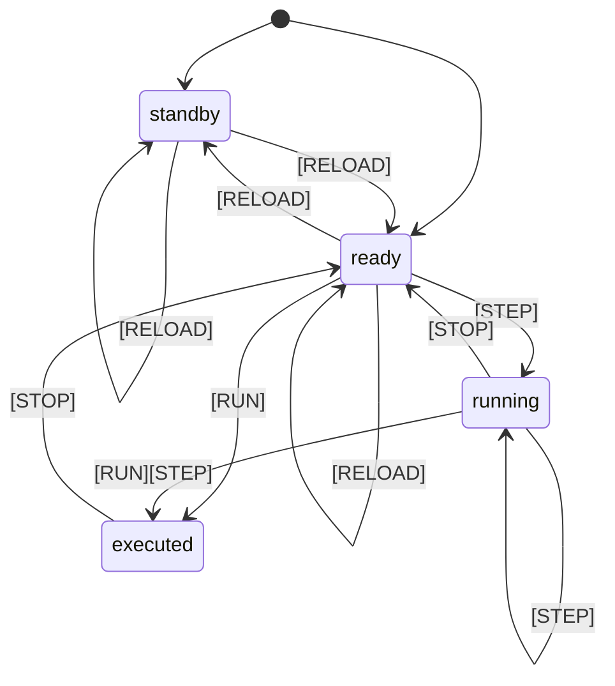

# RISC-Vシミュレーター

RISC-Vの挙動をブラウザ上で視覚的に確認できるシミュレーターです。
RV32I（全40命令）のうち37命令に対応しています。

## 動作要件

* Go（version 1.21以降）がインストールされていること
 
 例
 ```
 $ go version
go version go1.21.0 linux/amd64
 ```

## 起動手順

アセンブリのソースファイル名をコマンドライン引数で渡して `rv32i.go` を実行します。

例
```Shell
go run rv32i.go examples/ex01.asm
```

* シミュレーター本体は1ファイル構成です
* ビルドして実行することも可能です
* 複数の引数が渡された場合は先頭を採用します

## 使い方

シミュレーターを起動後、ブラウザで `http://localhost:8532/` にアクセスすると画面が表示されます。エラーがあるときは標準エラー（ `stderr` ）にメッセージを出力します。


* 背景色付きの命令を実行した結果、書き込みされた値は赤文字になり、参照された値は青文字になります
* 命令アドレスの赤文字と青文字はジャンプする／しないを表します
* 符号付き（signed）と符号なし（unsigned）で命令が別々の場合、対象でない値は取り消し線になります
* レイアウトのデザインは `アセンブリ` `レジスタ` `メインメモリ` の３テーブルを横並びさせるのに十分な表示幅が確保されている状態向けに調整しています

| ボタン | 説明 |
| ---- | ---- |
| RUN    | プログラムを実行し、レジスタとメインメモリの最終状態を画面に反映します |
| STEP   | プログラムを1命令だけステップ実行します。ステップ実行中はボタンがフォーカスされ、 `Enter` キーで継続的に実行できる状態になります |
| STOP   | プログラムを停止し、レジスタとメインメモリの内容をクリアします |
| RELOAD | アセンブリのソースファイルをリロードします |



## 仕様

* RV32Iのうち `ECALL` / `EBREAK` / `FENCE` の3命令は未対応です
* 対応している疑似命令はありません。アセンブラの機能としてラベル（区切り文字： `:` ）は対応しています
* `#` もしくは `;` 以降をコメントとして扱います。なお、 `.` で始まる行はディレクティブと見做し、コメント行と同様の扱いになります。ただし、 `.` で始まるラベルは有効です
* 同一命令アドレスに複数のラベルが付与されている場合、後から付与されたラベルを優先して画面に表示します。ジャンプ先の指定には表示されていないラベルも含め有効です
* 同一名称のラベルを複数の命令アドレスに付与することはできません。直前のラベルを優先するような置き換えはしていません
* 条件分岐命令のOffsetの範囲は `±4KiB` で、 `JAL` 命令のOffsetの範囲は `±1MiB` ですが、 `JALR` 命令では32ビットの全範囲にジャンプできます。ラベルの指定は制限なく32ビットの全範囲が可能です
* メインメモリは `0x00000000` から `0xffffffff` の全範囲をロード／ストアできます。最後にロードもしくはストアした周辺 `512` バイトの範囲を画面に表示します
* エンディアンは `little-endian` です
* 命令のアドレス空間はデータ構造上、独立しています。命令アドレスを指定しても、命令エンコードをロード／ストアすることはできません。命令エンコードは内部的にも存在していません
* 最後の命令の実行後、もしくはジャンプ先の命令アドレスが有効でない場合にプログラムは終了します

### 命令一覧

| 命令 | アセンブリ | 処理 | 備考 |
| ---- | ---- | ---- | ---- |
| ADD   | add rd, rs1, rs2 | rd = rs1 + rs2 ||
| ADDI  | addi rd, rs1, immediate | rd = rs1 + immediate | immediateは符号付き12ビット |
| SUB   | sub rd, rs1, rs2 | rd = rs1 - rs2 ||
| AND   | and rd, rs1, rs2 | rd = rs1 & rs2 ||
| ANDI  | andi rd, rs1, immediate | rd = rs1 & immediate | immediateは符号付き12ビット |
| OR    | or rd, rs1, rs2 | rd = rs1 \| rs2 ||
| ORI   | ori rd, rs1, immediate | rd = rs1 \| immediate | immediateは符号付き12ビット |
| XOR   | xor rd, rs1, rs2 | rd = rs1 ^ rs2 ||
| XORI  | xori rd, rs1, immediate | rd = rs1 ^ immediate | immediateは符号付き12ビット |
| SLL   | sll rd, rs1, rs2 | rd = rs1 << rs2 | rs2の下位5ビット |
| SLLI  | slli rd, rs1, shamt | rd = rs1 << shamt | shamtは0以上31以下 |
| SRL   | srl rd, rs1, rs2 | rd = rs1 >> rs2 | 論理シフト。rs2の下位5ビット |
| SRLI  | srli rd, rs1, shamt | rd = rs1 >> shamt | 論理シフト。shamtは0以上31以下 |
| SRA   | sra rd, rs1, rs2 | rd = rs1 >> rs2 | 算術シフト。rs2の下位5ビット |
| SRAI  | srai rd, rs1, shamt | rd = rs1 >> shamt | 算術シフト。shamtは0以上31以下 |
| SLT   | slt rd, rs1, rs2 | if rs1 < rs2 then rd = 1<br>else rd = 0 | 符号付き比較 |
| SLTU  | sltu rd, rs1, rs2 | if rs1 < rs2 then rd = 1<br>else rd = 0 | 符号なし比較 |
| SLTI  | slti rd, rs1, immediate | if rs1 < immediate then rd = 1<br>else rd = 0 | 符号付き比較<br>immediateは符号付き12ビット |
| SLTIU | sltiu rd, rs1, immediate | if rs1 < immediate then rd = 1<br>else rd = 0 | 符号なし比較<br>immediateは符号なし12ビット |
| LUI   | lui rd, immediate | rd = immediate << 12 | immediateは符号なし20ビット |
| AUIPC | auipc rd, immediate | rd = pc + (immediate << 12) | immediateは符号なし20ビット |
| LB    | lb rd, offset(rs1) | rd = byte ptr [rs1 + offset] | 1バイト符号拡張<br>offsetは符号付き12ビット、省略可 |
| LBU   | lbu rd, offset(rs1) | rd = byte ptr [rs1 + offset] | 1バイトゼロ拡張<br>offsetは符号付き12ビット、省略可 |
| LH    | lh rd, offset(rs1) | rd = 2 bytes ptr [rs1 + offset] | 2バイト(little-endian)符号拡張<br>offsetは符号付き12ビット、省略可 |
| LHU   | lhu rd, offset(rs1) | rd = 2 bytes ptr [rs1 + offset] | 2バイト(little-endian)ゼロ拡張<br>offsetは符号付き12ビット、省略可 |
| LW    | lw rd, offset(rs1) | rd = 4 bytes ptr [rs1 + offset] | 4バイト(little-endian)<br>offsetは符号付き12ビット、省略可 |
| SB    | sb rs2, offset(rs1) | byte ptr [rs1 + offset] = rs2 | 最下位1バイト<br>offsetは符号付き12ビット、省略可 |
| SH    | sh rs2, offset(rs1) | 2 bytes ptr [rs1 + offset] = rs2 | 最下位2バイト(little-endian)<br>offsetは符号付き12ビット、省略可 |
| SW    | sw rs2, offset(rs1) | 4 bytes ptr [rs1 + offset] = rs2 | 4バイト(little-endian)<br>offsetは符号付き12ビット、省略可 |
| JAL   | jal rd, label | rd = pc + 4<br> pc = label | rd省略時はx1<br>&nbsp; |
| JALR  | jalr rd, offset(rs1) | rd = pc + 4<br> pc = pc + rs1 + offset | rd省略時はx1<br>offsetは符号付き12ビット、省略可 |
| BEQ   | beq rs1, rs2, label | if rs1 == rs2 then pc = label ||
| BNE   | bne rs1, rs2, label | if rs1 != rs2 then pc = label ||
| BLT   | blt rs1, rs2, label | if rs1 < rs2 then pc = label | 符号付き比較 |
| BLTU  | bltu rs1, rs2, label | if rs1 < rs2 then pc = label | 符号なし比較 |
| BGE   | bge rs1, rs2, label | if rs1 ≧ rs2 then pc = label | 符号付き比較 |
| BGEU  | bgeu rs1, rs2, label | if rs1 ≧ rs2 then pc = label | 符号なし比較 |

### 形式


# 参考資料

* The RISC-V Instruction Set Manual
  * https://riscv.org/technical/specifications/
    * Volume 1, Unprivileged Specification version 20191213
      * Preface
      * Chapter 1 Introduction
      * Chapter 2 RV32I Base Integer Instruction Set, Version 2.1
      * Chapter 24 RV32/64G Instruction Set Listings
      * Chapter 25 RISC-V Assembly Programmer’s Handbook
